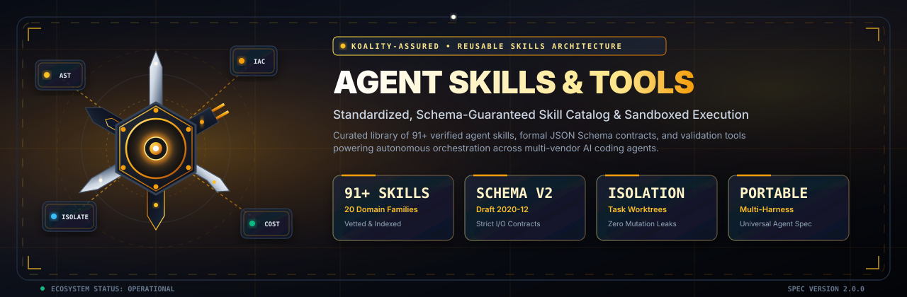
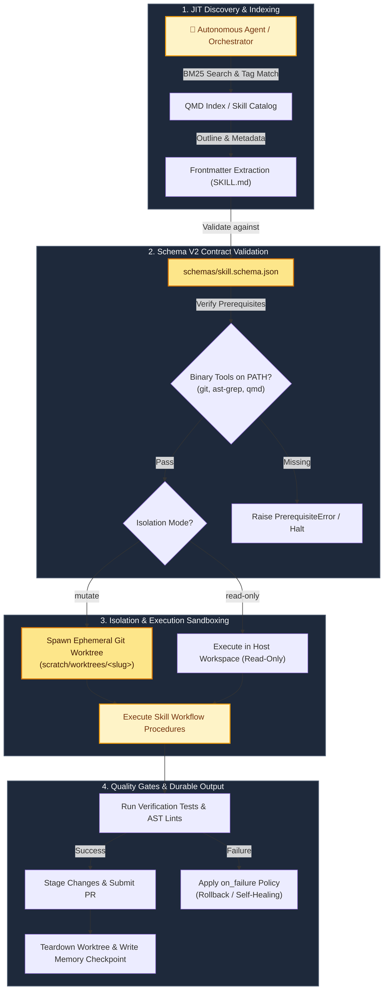

<div align="center">



<br/><br/>


# Agent Skills & Tools (`agent-skills-and-tools`)

**Production-Grade Reusable Agent Skills, Formal Tool Schemas & Autonomous Execution Framework**

[](https://github.com/Koality-Assured/agent-skills-and-tools/actions/workflows/ci.yml)
[](LICENSE)
[](pyproject.toml)
[](skills/)
[](schemas/)
[](https://conventionalcommits.org)
[](https://github.com/astral-sh/ruff)

<br/>

</div>

## Mission Statement & Elevator Pitch

`agent-skills-and-tools` is the canonical open-source ecosystem repository of verified, reusable agent skills, formal JSON Schema specifications, and operational validation tooling for autonomous software engineering and multi-agent orchestration frameworks.

In modern multi-agent systems, agents frequently suffer from prompt bloat, unstructured skill execution, leaking workspace mutations, and fragile undocumented tool parameters. `agent-skills-and-tools` solves these problems by providing:
1. **Schema V2 Guarantees:** Strict JSON Schema (Draft 2020-12) validation for skill frontmatter, binary prerequisites, and I/O contracts.
2. **Deterministic Sandboxing:** Built-in isolation semantics (`mutate` vs. `read-only`) preventing mutation pollution across primary branches.
3. **Curated Domain Catalog:** 91+ production-tested skills spanning 20 functional families—from cloud governance and AST fact extraction to cost-layer proxies and executive reporting.
4. **Harness-Agnostic Portability:** Standardized markdown and JSON specifications compatible with any AI coding agent runtime (Claude Code, Google Antigravity, OpenAI Swarm, AutoGen, and custom harnesses).

---

## Architecture & Schema V2 Specification

Every skill in the repository is packaged as an independent capability unit governed by formal JSON Schemas located in [`schemas/`](schemas/).

```
agent-skills-and-tools/
├── .github/workflows/ci.yml    # Multi-version CI matrix & automated schema linting
├── assets/                     # Vector branding identities (banner & logo SVGs)
├── schemas/                    # Formal JSON Schema specifications (Draft 2020-12)
│   ├── skill.schema.json       # Frontmatter metadata, DAG dependencies, & I/O contracts
│   └── tool.schema.json        # Tool declaration and parameter specification schema
├── skills/                     # Curated skill library (91+ skills in 20 families)
│   ├── admin/                  # Tenant & LLM vendor governance
│   ├── aws/                    # AWS diagnostics, posture auditing & mutations
│   ├── azure/                  # Azure resource graph & activity log auditing
│   ├── benchmarks/             # Fleet sweeps, cost models & retrieval benchmarks
│   ├── community/              # OSINT, pattern analysis & tech news intelligence
│   ├── confluence/             # Confluence administration & app governance
│   ├── cost-layers/            # Headroom compression & ast-grep token reduction
│   ├── discovery/              # Bounded web crawling & discovery
│   ├── gcp/                    # Google Cloud Logging & resource auditing
│   ├── git/                    # Git operations & GitHub CLI automation
│   ├── google/                 # Google Workspace, Drive & Gmail orchestration
│   ├── harness-review/         # Agent harness control-plane review
│   ├── iac/                    # Terraform/OpenTofu validation & security audits
│   ├── memory/                 # Agent operational memory lifecycle
│   ├── meta/                   # Harness engineering & agent builder meta-skills
│   ├── model-memory-operate/   # Model-level episodic memory deduplication
│   ├── reporting/              # Architecture diagrams, dashboards & humanizers
│   ├── research/               # Local zero-overhead web fetching
│   ├── security/               # Active Directory & Windows security auditing
│   └── slack/                  # Slack app management & Block Kit dispatch
├── tools/                      # Validation CLI & schema verification engine
│   ├── __init__.py
│   └── validator.py            # High-performance skill validator CLI
├── tests/                      # Automated unit and integration test suite
│   ├── __init__.py
│   └── test_skills.py          # Regression tests verifying all skills & schemas
├── pyproject.toml              # Build backend and dependency declarations
└── README.md                   # Repository documentation & catalog reference
```

### Schema V2 Contract Anatomy

Skills are defined with strict YAML frontmatter at the top of their `SKILL.md` documents, conforming to [`schemas/skill.schema.json`](schemas/skill.schema.json):

```yaml
---
schema_version: "2.0.0"
name: "git-worktree-isolate"
description: "Isolates mutating tasks into ephemeral git worktrees before modifications."
owner_agent: "harness-operator"
rank: "critical"
isolation: "mutate"
on_failure: "abort-and-rollback"
version: "1.2.0"
tags: ["git", "worktree", "sandboxing", "isolation"]
author: "Koality-Assured"
prerequisites:
  - "git"
  - "gh"
tool_dependencies:
  - "run_command"
  - "view_file"
contracts:
  inputs:
    slug: "kebab-case identifier for the task worktree"
  outputs:
    worktree_path: "absolute filesystem path to ephemeral workspace"
dependencies:
  requires: ["git-basics"]
---
```

#### Core Contract Fields

| Field | Type | Requirement | Description |
| :--- | :--- | :--- | :--- |
| `name` | string (regex) | **Required** | Unique kebab-case identifier (e.g. `ast-grep`, `anti-slop`). |
| `description` | string | **Required** | Minimum 10 characters detailing what the skill does and trigger criteria. |
| `schema_version` | string | Optional | Declares the schema contract version (e.g. `2.0.0`). |
| `owner_agent` | string | Optional | Specialist agent archetype designated to own and execute this skill. |
| `rank` | enum | Optional | Severity rank (`critical`, `high`, `medium`, `low`). |
| `isolation` | enum | Optional | Sandboxing level (`mutate` for worktree isolation, `read-only` for inspection). |
| `on_failure` | string | Optional | Deterministic recovery lifecycle policy upon step failure. |
| `version` | string (SemVer) | Optional | Semantic version string adhering to SemVer 2.0. |
| `tags` | array[string] | Optional | Routing and retrieval indexing tags for BM25 and vector discovery. |
| `prerequisites` | array[string] | Optional | Binary tools required to be present and executable on system `$PATH`. |
| `tool_dependencies` | array[string] | Optional | Host agent tool declarations required for invocation. |
| `contracts` | object | Optional | Formal input argument schemas and output artifact specifications. |
| `dependencies` | object | Optional | DAG prerequisites and prerequisite ordering rules. |

---

## Domain Families Breakdown

The library hosts **91 verified skills** organized into **20 domain families**:

| Domain Family | Skill Count | Primary Scope & Capabilities |
| :--- | :---: | :--- |
| **`admin`** | 2 | Cloud tenant provisioning, landing zones, account vending, and public LLM vendor API key governance. |
| **`aws`** | 3 | CloudTrail & CloudWatch diagnostics, read-only resource posture audits, and human-authorized mutations with named profiles. |
| **`azure`** | 3 | Azure Activity & Monitor diagnostics, read-only resource graph inspections, and bounded mutation operations. |
| **`benchmarks`** | 5 | Agent fleet sweeps, token cost estimators, retrieval accuracy benchmarks (MRR/NDCG), task evals, and tool call efficiency. |
| **`community`** | 8 | Breaking technical news monitoring, recurring architecture pattern extraction, registry reliability auditing, niche discovery, OSINT, and sentiment analysis. |
| **`confluence`** | 4 | Space permissions, declarative Forge/Connect app management, page hierarchy docs governance, and webhook event automation. |
| **`cost-layers`** | 3 | `ast-grep` AST structural queries, `headroom` local context-compression proxy, and dry-run token savings measurement. |
| **`discovery`** | 1 | Authorized, bounded, read-only web crawling and sitemap extraction. |
| **`gcp`** | 3 | Google Cloud Logging audits, read-only asset inventory checks, and project-scoped write operations with safety gates. |
| **`git`** | 3 | Repository lifecycle operations, branch resolution, GitHub CLI (`gh`) PR automation, and repo-to-host path resolution. |
| **`google`** | 4 | Google Workspace domain governance, Drive document management, Gmail batch triage/drafting, and metadata auditing. |
| **`harness-review`**| 1 | Comprehensive control-plane auditing across agent definitions, skill catalogs, routing tables, and A2A interaction protocols. |
| **`iac`** | 3 | Infrastructure-as-Code security audits (tfsec, checkov), Terraform/OpenTofu module scaffolding, and plan validation. |
| **`memory`** | 3 | Agent operational memory checkpoint creation, delta adjustments, and stale memory cleanup under `ai-tooling/memory/`. |
| **`meta`** | 21 | Agent authoring, skill authoring, script building, doc building, antagonistic reviews, worktree isolation, QMD search tuning, and repository synchronization. |
| **`model-memory-operate`** | 1 | Model-level episodic memory retrieval, deduplication, and evidence promotion. |
| **`reporting`** | 17 | High-craft technical deliverables: anti-slop, humanizers, architecture diagrams, Mermaid/Excalidraw charts, Tabler dashboards, and threat models. |
| **`research`** | 1 | Zero-overhead local web fetcher for extracting clean Markdown from vendor documentation. |
| **`security`** | 1 | Read-only, evidence-backed Active Directory and Windows OS security configuration audits. |
| **`slack`** | 4 | Workspace security and SSO auditing, declarative Slack App manifest validation, Block Kit messaging, and webhooks. |

---

## Skill Lifecycle & Agent Discovery

Autonomous agents discover and execute skills via a multi-stage, just-in-time (JIT) lifecycle:



---

## Installation & Testing

### Prerequisites
- **Python:** 3.10, 3.11, or 3.12
- **Git:** Standard CLI installed on `$PATH`

### Local Setup

```bash
# Clone the repository
git clone https://github.com/Koality-Assured/agent-skills-and-tools.git
cd agent-skills-and-tools

# Create and activate virtual environment
python -m venv .venv
source .venv/bin/activate  # On Windows: .venv\Scripts\Activate.ps1

# Install in editable mode with development dependencies
pip install -e ".[dev]"
```

### Validating Skills with the CLI

The repository includes a standalone validator CLI (`agent-skills` / `tools/validator.py`):

```bash
# Validate all 91+ skills against schemas/skill.schema.json
python tools/validator.py --all

# Validate a specific skill directory or SKILL.md file
python tools/validator.py --skill skills/cost-layers/ast-grep

# Validate a tool schema declaration
python tools/validator.py --tool-schema schemas/tool.schema.json
```

### Running Test Suites

Execute the regression test suite across all schemas and skill files:

```bash
# Run unit tests via unittest
python -m unittest discover -s tests -v

# Run unit tests via pytest
pytest tests/ -v
```

---

## Authoring a New Skill

To introduce a new skill, create a dedicated folder under `skills/<domain-family>/<skill-name>/` with a `SKILL.md` adhering to `schemas/skill.schema.json`:

```markdown
---
schema_version: "2.0.0"
name: "my-domain-skill"
description: "Clear, actionable explanation of what the skill does and exact trigger conditions."
owner_agent: "domain-operator"
rank: "high"
isolation: "mutate"
on_failure: "abort-and-rollback"
version: "1.0.0"
tags: ["domain", "automation"]
author: "Koality-Assured"
prerequisites:
  - "git"
tool_dependencies:
  - "run_command"
---

# My Domain Skill

## Intent
Brief summary of the capability and expected outcome.

## Trigger Conditions
- When the user asks for automated domain verification.
- When an upstream workflow triggers this capability.

## Execution Procedure
1. Step-by-step deterministic procedures.
2. Run automated validation checks.
3. Commit and generate summary artifact.
```

After authoring, verify your skill using:
```bash
python tools/validator.py --skill skills/<domain-family>/<skill-name>
```

---

## Security & Sandboxing Principles

All skills and tool definitions follow rigorous defense-in-depth security standards:
- **Zero-Leak Sandboxing:** Any mutating skill MUST declare `isolation: mutate` and execute inside an ephemeral git worktree or isolated container.
- **AST Safety Gates:** Code-modifying skills validate abstract syntax trees prior to filesystem commits to prevent corrupted syntax.
- **Credential Masking:** Skills MUST NOT interpolate raw API keys or tokens into prompts or agent conversational memory.
- **Strict I/O Validation:** Tool parameter specifications use Draft 2020-12 JSON Schema to reject malformed or adversarial arguments.

To report a vulnerability, please email `security@koality-assured.org` or open a private GitHub Security Advisory.

---

## License

Distributed under the [MIT License](LICENSE). Copyright &copy; 2026 Koality-Assured.
